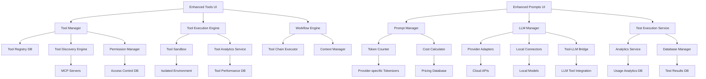

# Design Document

## Overview

This design document outlines the technical architecture for enhancing the MCP Admin Application with comprehensive LLM integration, advanced MCP tools management, real-time testing capabilities, and sophisticated analytics. The design extends the existing modular architecture to support multiple LLM providers (both cloud-based and local), intelligent tool orchestration, sophisticated token analysis, cost tracking, and performance optimization features.

The enhanced system will transform the MCP Admin Application from a basic server management tool into a comprehensive prompt engineering, tool orchestration, and optimization platform while maintaining the existing security, audit, and administration capabilities.

## Architecture

### High-Level Architecture

```
┌─────────────────────────────────────────────────────────────────┐
│                    MCP Admin Application                        │
├─────────────────────────────────────────────────────────────────┤
│  UI Layer (Enhanced)                                            │
│  ├── Enhanced Tools Page (Interactive Testing & Workflows)     │
│  │   ├── Multi-Selection Interface (Extended Selection Mode)   │
│  │   ├── Context Menus (Right-click Operations)               │
│  │   ├── Status Bar (Real-time Selection Information)         │
│  │   ├── Mouse Wheel Scrolling (Batch Dialog Navigation)      │
│  │   └── Deletion Interface (Single & Bulk Operations)        │
│  ├── Enhanced Prompts Page (Real-time Testing)                 │
│  ├── LLM Providers Page (Multi-provider Management)            │
│  ├── Analytics Dashboard (Usage & Cost Insights)               │
│  └── Existing Pages (Servers, Security, Audit)                 │
├─────────────────────────────────────────────────────────────────┤
│  Services Layer (Extended)                                      │
│  ├── Advanced Tool Manager (Registry, Testing, Workflows)      │
│  │   ├── Tool Deletion Service (Single & Bulk Operations)     │
│  │   ├── Multi-Selection Manager (Extended Selection Logic)    │
│  │   └── UI State Manager (Button & Interface State Control)  │
│  ├── Tool Execution Engine (Sandboxing & Orchestration)        │
│  ├── Tool Analytics Service (Performance & Usage Tracking)     │
│  ├── Enhanced Prompt Manager (Version Control + Testing)       │
│  ├── LLM Manager (Multi-provider Integration)                  │
│  ├── Token Counter Service (Multi-provider Support)            │
│  ├── Cost Calculator Service (Real-time Pricing)               │
│  ├── Analytics Service (Usage Tracking & Insights)             │
│  ├── Test Execution Service (Batch & A/B Testing)              │
│  └── Existing Services (Server, Security, Audit)               │
├─────────────────────────────────────────────────────────────────┤
│  Data Layer (Expanded)                                          │
│  ├── Tool Registry Database (Metadata, Configs, Permissions)   │
│  ├── Tool Execution History (Results, Performance, Analytics)  │
│  ├── Enhanced Database Schema (LLM & Analytics Tables)         │
│  ├── Secure Credential Storage (Encrypted API Keys)            │
│  ├── Usage Analytics Storage (Performance Metrics)             │
│  └── Existing Storage (Configs, Logs, Audit Trail)             │
├─────────────────────────────────────────────────────────────────┤
│  Tool Orchestration Layer (New)                                │
│  ├── Tool Discovery Engine (Auto-detection & Classification)   │
│  ├── Tool Execution Sandbox (Secure Isolation)                 │
│  ├── Workflow Engine (Tool Chaining & Automation)              │
│  ├── Permission Manager (Access Control & Rate Limiting)       │
│  └── LLM-Tool Integration (Intelligent Recommendations)        │
├─────────────────────────────────────────────────────────────────┤
│  LLM Integration Layer (Enhanced)                               │
│  ├── Provider Adapters (OpenAI, Anthropic, Azure, Google)      │
│  ├── Local Model Connectors (Ollama, LM Studio, Custom)        │
│  ├── Token Counting Engines (Provider-specific)                │
│  ├── Tool-LLM Bridge (Context Sharing & Recommendations)       │
│  └── Response Processing Pipeline                               │
└─────────────────────────────────────────────────────────────────┘
```

### Component Interaction Flow



## Components and Interfaces

### 1. Advanced Tool Manager Service

**Purpose**: Comprehensive management of MCP tools including discovery, registry maintenance, configuration, and lifecycle management.

**Key Responsibilities**:
- Automatic tool discovery from connected MCP servers
- Tool registry maintenance with metadata and categorization
- Tool configuration and parameter management
- Permission and access control management
- Tool status monitoring and health checks

**Interface**:
```python
class AdvancedToolManager:
    def discover_tools(self, server_id: str) -> List[ToolInfo]
    def register_tool(self, tool_info: ToolInfo) -> str
    def get_tool_registry(self, filters: ToolFilters) -> List[ToolRegistryEntry]
    def configure_tool(self, tool_id: str, config: ToolConfiguration) -> bool
    def set_tool_permissions(self, tool_id: str, permissions: ToolPermissions) -> bool
    def get_tool_status(self, tool_id: str) -> ToolStatus
    def categorize_tool(self, tool_info: ToolInfo) -> ToolCategory
    def search_tools(self, query: str, filters: Dict) -> List[ToolRegistryEntry]
    def bulk_update_tools(self, updates: List[ToolUpdate]) -> BulkUpdateResult
```

### 2. Tool Execution Engine

**Purpose**: Secure and monitored execution of MCP tools with sandboxing, performance tracking, and result management.

**Key Responsibilities**:
- Secure tool execution in isolated environments
- Parameter validation and input sanitization
- Execution monitoring and performance tracking
- Result capture and storage
- Error handling and recovery

**Interface**:
```python
class ToolExecutionEngine:
    def execute_tool(self, execution_request: ToolExecutionRequest) -> ToolExecutionResult
    def validate_parameters(self, tool_id: str, parameters: Dict) -> ValidationResult
    def get_execution_history(self, filters: ExecutionFilters) -> List[ToolExecution]
    def cancel_execution(self, execution_id: str) -> bool
    def get_execution_status(self, execution_id: str) -> ExecutionStatus
    def batch_execute_tools(self, batch_request: BatchExecutionRequest) -> BatchExecutionResult
    def get_performance_metrics(self, tool_id: str, time_range: TimeRange) -> PerformanceMetrics
```

### 3. Workflow Engine

**Purpose**: Creation and execution of complex tool chains and automated workflows with conditional logic and error handling.

**Key Responsibilities**:
- Visual workflow creation and editing
- Tool chain validation and optimization
- Workflow execution with progress tracking
- Conditional branching and error handling
- Context sharing between tool executions

**Interface**:
```python
class WorkflowEngine:
    def create_workflow(self, workflow_definition: WorkflowDefinition) -> str
    def validate_workflow(self, workflow_id: str) -> ValidationResult
    def execute_workflow(self, workflow_id: str, inputs: Dict) -> WorkflowExecution
    def get_workflow_progress(self, execution_id: str) -> WorkflowProgress
    def pause_workflow(self, execution_id: str) -> bool
    def resume_workflow(self, execution_id: str) -> bool
    def get_workflow_templates(self) -> List[WorkflowTemplate]
    def clone_workflow(self, workflow_id: str, new_name: str) -> str
```

### 4. Tool Discovery Engine

**Purpose**: Automatic detection, classification, and metadata extraction for MCP tools across connected servers.

**Key Responsibilities**:
- Continuous monitoring of MCP servers for new tools
- Tool schema analysis and metadata extraction
- Automatic categorization and tagging
- Change detection and registry updates
- Tool compatibility assessment

**Interface**:
```python
class ToolDiscoveryEngine:
    def scan_server_tools(self, server_id: str) -> List[DiscoveredTool]
    def analyze_tool_schema(self, tool_schema: Dict) -> ToolAnalysis
    def categorize_tool_automatically(self, tool_info: ToolInfo) -> ToolCategory
    def detect_tool_changes(self, server_id: str) -> List[ToolChange]
    def schedule_discovery_scan(self, server_id: str, interval: int) -> bool
    def get_discovery_status(self, server_id: str) -> DiscoveryStatus
    def extract_tool_metadata(self, tool_schema: Dict) -> ToolMetadata
```

### 5. Tool Analytics Service

**Purpose**: Comprehensive analytics and performance monitoring for tool usage, efficiency, and optimization insights.

**Key Responsibilities**:
- Usage pattern analysis and trending
- Performance benchmarking and optimization
- Cost analysis for tool executions
- Quality assessment and scoring
- Recommendation generation

**Interface**:
```python
class ToolAnalyticsService:
    def track_tool_usage(self, usage_event: ToolUsageEvent) -> None
    def get_usage_analytics(self, filters: AnalyticsFilters) -> ToolAnalyticsReport
    def get_performance_trends(self, tool_id: str, time_range: TimeRange) -> TrendAnalysis
    def analyze_tool_efficiency(self, tool_id: str) -> EfficiencyAnalysis
    def get_cost_breakdown(self, grouping: GroupingType) -> ToolCostBreakdown
    def generate_optimization_recommendations(self, tool_id: str) -> List[OptimizationRecommendation]
    def compare_tool_performance(self, tool_ids: List[str]) -> ComparisonReport
    def get_quality_metrics(self, tool_id: str) -> QualityMetrics
```

### 6. Permission Manager

**Purpose**: Fine-grained access control, rate limiting, and security policy enforcement for tool executions.

**Key Responsibilities**:
- Role-based access control (RBAC) for tools
- Usage quotas and rate limiting
- Security policy enforcement
- Audit trail for permission changes
- Bulk permission management

**Interface**:
```python
class PermissionManager:
    def set_tool_permissions(self, tool_id: str, permissions: ToolPermissions) -> bool
    def check_execution_permission(self, user_id: str, tool_id: str) -> PermissionResult
    def apply_rate_limits(self, user_id: str, tool_id: str) -> RateLimitResult
    def get_user_permissions(self, user_id: str) -> List[ToolPermission]
    def bulk_update_permissions(self, updates: List[PermissionUpdate]) -> BulkPermissionResult
    def create_permission_role(self, role_definition: RoleDefinition) -> str
    def audit_permission_changes(self, filters: AuditFilters) -> List[PermissionAuditEvent]
```

### 7. Tool Sandbox

**Purpose**: Secure, isolated execution environment for MCP tools with resource monitoring and containment.

**Key Responsibilities**:
- Process isolation and containerization
- Resource limit enforcement (CPU, memory, network)
- File system access control
- Network traffic monitoring and filtering
- Security violation detection and response

**Interface**:
```python
class ToolSandbox:
    def create_sandbox(self, sandbox_config: SandboxConfig) -> str
    def execute_in_sandbox(self, sandbox_id: str, execution_request: ExecutionRequest) -> ExecutionResult
    def monitor_resource_usage(self, sandbox_id: str) -> ResourceUsage
    def enforce_security_policies(self, sandbox_id: str, policies: List[SecurityPolicy]) -> bool
    def destroy_sandbox(self, sandbox_id: str) -> bool
    def get_sandbox_logs(self, sandbox_id: str) -> List[SandboxLogEntry]
    def quarantine_tool(self, tool_id: str, reason: str) -> bool
```

### 8. Enhanced UI Management System

**Purpose**: Comprehensive user interface management for tool operations including deletion, multi-selection, and enhanced navigation.

**Key Responsibilities**:
- Multi-selection interface management with extended selection mode
- Context menu operations for right-click functionality
- Real-time status bar updates showing selection information
- Mouse wheel scrolling support for improved navigation
- Keyboard shortcut handling for efficient operations

**Interface**:
```python
class EnhancedUIManager:
    def enable_multi_selection(self, tree_widget: ttk.Treeview) -> None
    def create_context_menu(self, parent: tk.Widget, operations: List[MenuOperation]) -> tk.Menu
    def update_status_bar(self, selection_count: int, total_count: int) -> None
    def enable_mouse_wheel_scrolling(self, canvas: tk.Canvas) -> None
    def bind_keyboard_shortcuts(self, widget: tk.Widget, shortcuts: Dict[str, Callable]) -> None
    def manage_button_states(self, selection: List[str], buttons: Dict[str, ttk.Button]) -> None
```

### 9. Tool Deletion Management System

**Purpose**: Safe and comprehensive tool deletion with confirmation dialogs, bulk operations, and data cleanup.

**Key Responsibilities**:
- Single tool deletion with detailed confirmation dialogs
- Bulk deletion operations with progress tracking
- Automatic cleanup of execution history and related data
- Safety validations and error handling
- User feedback and operation status reporting

**Interface**:
```python
class ToolDeletionManager:
    def delete_single_tool(self, tool_id: str, confirmation_callback: Callable) -> DeletionResult
    def delete_multiple_tools(self, tool_ids: List[str], progress_callback: Callable) -> BulkDeletionResult
    def validate_deletion_safety(self, tool_id: str) -> SafetyValidation
    def cleanup_related_data(self, tool_id: str) -> CleanupResult
    def show_confirmation_dialog(self, tool_info: ToolInfo, impact_analysis: ImpactAnalysis) -> bool
    def track_deletion_progress(self, operation_id: str) -> DeletionProgress
```

### 10. Enhanced LLM Manager Service

**Purpose**: Central orchestration of all LLM provider interactions with unified interface.

**Key Responsibilities**:
- Provider registration and configuration management
- API key secure storage and retrieval
- Provider health monitoring and failover
- Request routing and load balancing
- Response standardization across providers

**Interface**:
```python
class LLMManager:
    def register_provider(self, provider_config: LLMProviderConfig) -> str
    def test_provider_connection(self, provider_id: str) -> ConnectionResult
    def execute_prompt(self, provider_id: str, prompt: str, parameters: Dict) -> LLMResponse
    def get_available_models(self, provider_id: str) -> List[ModelInfo]
    def get_provider_status(self, provider_id: str) -> ProviderStatus
    def estimate_cost(self, provider_id: str, input_tokens: int, estimated_output: int) -> CostEstimate
```

### 2. Multi-Provider Adapter System

**Purpose**: Standardized interface for different LLM providers with provider-specific implementations.

**Base Provider Interface**:
```python
class BaseLLMProvider:
    def authenticate(self, credentials: Dict) -> bool
    def get_models(self) -> List[ModelInfo]
    def count_tokens(self, text: str, model: str) -> int
    def execute_request(self, request: LLMRequest) -> LLMResponse
    def get_pricing_info(self, model: str) -> PricingInfo
    def validate_connection(self) -> ConnectionStatus
```

**Provider Implementations**:
- `OpenAIProvider`: OpenAI API integration with GPT models
- `AnthropicProvider`: Claude API integration
- `AzureOpenAIProvider`: Azure OpenAI service integration
- `GoogleProvider`: Google AI/Vertex AI integration
- `OllamaProvider`: Local Ollama model integration
- `LMStudioProvider`: LM Studio local model integration
- `CustomProvider`: Generic local/custom endpoint support

### 3. Advanced Token Counter Service

**Purpose**: Accurate token counting across different provider tokenization methods.

**Key Features**:
- Provider-specific tokenization algorithms
- Real-time token counting for input prompts
- Output token estimation based on model characteristics
- Token efficiency analysis and optimization suggestions

**Interface**:
```python
class TokenCounterService:
    def count_input_tokens(self, text: str, provider: str, model: str) -> int
    def estimate_output_tokens(self, prompt: str, provider: str, model: str) -> TokenEstimate
    def analyze_token_efficiency(self, prompt: str, response: str) -> EfficiencyMetrics
    def get_tokenizer_info(self, provider: str, model: str) -> TokenizerInfo
```

### 4. Cost Calculator Service

**Purpose**: Real-time cost estimation and tracking with current pricing data.

**Key Features**:
- Current pricing database with automatic updates
- Real-time cost estimation before execution
- Actual cost tracking and comparison
- Budget management and alerting
- Cost optimization recommendations

**Interface**:
```python
class CostCalculatorService:
    def estimate_cost(self, provider: str, model: str, input_tokens: int, output_tokens: int) -> CostEstimate
    def track_actual_cost(self, execution_id: str, actual_usage: UsageMetrics) -> None
    def get_usage_summary(self, time_period: TimePeriod, filters: Dict) -> UsageSummary
    def check_budget_limits(self, provider: str, estimated_cost: float) -> BudgetStatus
    def get_cost_optimization_suggestions(self, usage_history: List[Usage]) -> List[Suggestion]
```

### 5. Test Execution Service

**Purpose**: Orchestrate comprehensive testing workflows including batch and A/B testing.

**Key Features**:
- Single prompt testing against multiple providers
- Batch testing with progress tracking
- A/B testing with statistical analysis
- Performance benchmarking
- Quality assessment metrics

**Interface**:
```python
class TestExecutionService:
    def execute_single_test(self, test_config: TestConfig) -> TestResult
    def execute_batch_test(self, batch_config: BatchTestConfig) -> BatchTestResult
    def execute_ab_test(self, ab_config: ABTestConfig) -> ABTestResult
    def get_test_progress(self, test_id: str) -> TestProgress
    def cancel_test(self, test_id: str) -> bool
    def generate_test_report(self, test_results: List[TestResult]) -> TestReport
```

### 6. Analytics Service

**Purpose**: Comprehensive usage analytics, performance insights, and optimization recommendations.

**Key Features**:
- Real-time usage tracking
- Performance trend analysis
- Cost optimization insights
- Provider comparison analytics
- Prompt effectiveness scoring

**Interface**:
```python
class AnalyticsService:
    def track_usage_event(self, event: UsageEvent) -> None
    def get_usage_analytics(self, filters: AnalyticsFilters) -> AnalyticsReport
    def get_performance_trends(self, time_range: TimeRange) -> TrendAnalysis
    def get_cost_breakdown(self, grouping: GroupingType) -> CostBreakdown
    def get_optimization_recommendations(self) -> List[Recommendation]
    def generate_dashboard_data(self) -> DashboardData
```

## Data Models

### Tool Management Models

```python
@dataclass
class ToolRegistryEntry:
    id: str
    name: str
    description: str
    server_id: str
    category: ToolCategory
    schema: Dict[str, Any]
    parameters: List[ToolParameter]
    permissions: ToolPermissions
    status: ToolStatus
    metadata: ToolMetadata
    created_at: datetime
    updated_at: datetime
    last_used: Optional[datetime]
    usage_count: int
    average_execution_time: float
    success_rate: float

@dataclass
class ToolParameter:
    name: str
    type: str
    description: str
    required: bool
    default_value: Optional[Any]
    validation_rules: List[ValidationRule]
    examples: List[str]

@dataclass
class ToolExecution:
    id: str
    tool_id: str
    user_id: str
    parameters: Dict[str, Any]
    result: Optional[Dict[str, Any]]
    status: ExecutionStatus
    start_time: datetime
    end_time: Optional[datetime]
    execution_time: Optional[float]
    error_message: Optional[str]
    resource_usage: ResourceUsage
    sandbox_id: Optional[str]
    workflow_id: Optional[str]
    parent_execution_id: Optional[str]

@dataclass
class WorkflowDefinition:
    id: str
    name: str
    description: str
    version: str
    steps: List[WorkflowStep]
    connections: List[WorkflowConnection]
    error_handling: ErrorHandlingConfig
    created_by: str
    created_at: datetime
    updated_at: datetime
    is_template: bool
    tags: List[str]

@dataclass
class WorkflowStep:
    id: str
    tool_id: str
    name: str
    parameters: Dict[str, Any]
    conditions: List[ExecutionCondition]
    retry_config: RetryConfig
    timeout: int
    position: Position

@dataclass
class ToolPermissions:
    user_permissions: Dict[str, List[Permission]]
    role_permissions: Dict[str, List[Permission]]
    rate_limits: RateLimitConfig
    resource_limits: ResourceLimitConfig
    allowed_contexts: List[str]
    security_level: SecurityLevel

@dataclass
class ToolAnalytics:
    tool_id: str
    time_period: TimePeriod
    total_executions: int
    successful_executions: int
    failed_executions: int
    average_execution_time: float
    median_execution_time: float
    total_resource_usage: ResourceUsage
    cost_metrics: CostMetrics
    quality_score: float
    user_satisfaction: float
    optimization_opportunities: List[OptimizationOpportunity]
```

### Enhanced LLM Provider Models

```python
@dataclass
class LLMProviderConfig:
    id: str
    name: str
    provider_type: ProviderType  # OPENAI, ANTHROPIC, AZURE, GOOGLE, OLLAMA, CUSTOM
    endpoint_url: Optional[str]
    api_key_encrypted: Optional[str]
    models: List[ModelConfig]
    settings: Dict[str, Any]
    is_local: bool
    status: ProviderStatus
    created_at: datetime
    updated_at: datetime

@dataclass
class ModelConfig:
    model_id: str
    display_name: str
    max_tokens: int
    input_cost_per_token: float
    output_cost_per_token: float
    supports_streaming: bool
    context_window: int
    tokenizer_type: str
```

### Testing and Analytics Models

```python
@dataclass
class TestExecution:
    id: str
    prompt_template_id: str
    provider_id: str
    model_id: str
    parameters: Dict[str, Any]
    input_tokens: int
    output_tokens: int
    estimated_cost: float
    actual_cost: float
    response_time: float
    success: bool
    response_content: str
    error_message: Optional[str]
    quality_score: Optional[float]
    executed_at: datetime
    executed_by: str

@dataclass
class UsageMetrics:
    provider_id: str
    model_id: str
    total_requests: int
    successful_requests: int
    failed_requests: int
    total_input_tokens: int
    total_output_tokens: int
    total_cost: float
    average_response_time: float
    average_quality_score: float
    time_period: TimePeriod
    last_updated: datetime

@dataclass
class CostEstimate:
    input_cost: float
    estimated_output_cost: float
    total_estimated_cost: float
    confidence_level: float
    currency: str
    pricing_date: datetime
```

### Security and Credential Models

```python
@dataclass
class EncryptedCredential:
    provider_id: str
    credential_type: str  # API_KEY, TOKEN, CERTIFICATE
    encrypted_value: bytes
    encryption_method: str
    created_at: datetime
    expires_at: Optional[datetime]
    last_used: Optional[datetime]

@dataclass
class SecurityAuditEvent:
    id: str
    event_type: SecurityEventType
    provider_id: Optional[str]
    user_id: str
    description: str
    risk_level: RiskLevel
    metadata: Dict[str, Any]
    timestamp: datetime
```

### Enhanced UI and Deletion Models

```python
@dataclass
class UISelectionState:
    selected_items: List[str]
    selection_count: int
    total_items: int
    selection_mode: str  # "single", "multiple", "extended"
    last_selected: Optional[str]

@dataclass
class DeletionRequest:
    tool_ids: List[str]
    user_id: str
    confirmation_required: bool = True
    cleanup_execution_history: bool = True
    bulk_operation: bool = False

@dataclass
class DeletionResult:
    operation_id: str
    successful_deletions: List[str]
    failed_deletions: List[str]
    cleanup_results: Dict[str, bool]
    total_time: float
    errors: List[str]

@dataclass
class BulkDeletionProgress:
    operation_id: str
    total_items: int
    completed_items: int
    failed_items: int
    current_item: Optional[str]
    estimated_time_remaining: float
    status: str  # "running", "completed", "failed", "cancelled"

@dataclass
class MouseWheelScrollConfig:
    canvas_id: str
    scroll_sensitivity: int = 120
    scroll_units: str = "units"
    enabled: bool = True

@dataclass
class ContextMenuOperation:
    label: str
    command: Callable
    enabled: bool = True
    separator_after: bool = False
    icon: Optional[str] = None
```

## Error Handling

### Comprehensive Error Management Strategy

**1. Tool Execution Error Handling**:
- Parameter validation and sanitization before execution
- Sandbox isolation failure recovery
- Tool timeout and resource limit enforcement
- Execution rollback and cleanup procedures
- Workflow step failure isolation and recovery

**2. Security and Permission Error Management**:
- Access control violation detection and logging
- Rate limit enforcement with graceful degradation
- Security policy violation response and quarantine
- Audit trail integrity protection
- Credential validation and rotation

**3. Provider-Level Error Handling**:
- Connection timeouts and retries with exponential backoff
- API rate limiting detection and queuing
- Authentication failure recovery
- Model availability checking

**4. Cost Management Safeguards**:
- Budget limit enforcement before execution
- Cost estimation validation
- Spending alerts and automatic stops
- Usage quota management

**5. Testing Error Recovery**:
- Batch test failure isolation
- Partial result preservation
- Test resumption capabilities
- Error categorization and reporting

**6. Data Integrity Protection**:
- Encrypted credential validation
- Usage data consistency checks
- Analytics data verification
- Backup and recovery procedures

**7. Workflow Error Management**:
- Step-level error handling and retry logic
- Conditional branching on failure scenarios
- Context preservation across failed executions
- Workflow state recovery and resumption

### Error Response Models

```python
@dataclass
class ToolExecutionError:
    error_code: str
    error_type: ToolErrorType
    message: str
    tool_id: str
    execution_id: Optional[str]
    parameters: Optional[Dict[str, Any]]
    retry_after: Optional[int]
    suggested_action: str
    recovery_options: List[str]
    timestamp: datetime

@dataclass
class WorkflowError:
    error_code: str
    workflow_id: str
    step_id: Optional[str]
    error_type: WorkflowErrorType
    message: str
    context: Dict[str, Any]
    recovery_strategy: RecoveryStrategy
    timestamp: datetime

@dataclass
class LLMError:
    error_code: str
    error_type: ErrorType  # AUTHENTICATION, RATE_LIMIT, MODEL_UNAVAILABLE, COST_LIMIT
    message: str
    provider_id: str
    retry_after: Optional[int]
    suggested_action: str
    timestamp: datetime

class ToolErrorType(Enum):
    PARAMETER_VALIDATION_FAILED = "param_validation_failed"
    TOOL_UNAVAILABLE = "tool_unavailable"
    EXECUTION_TIMEOUT = "execution_timeout"
    RESOURCE_LIMIT_EXCEEDED = "resource_limit_exceeded"
    PERMISSION_DENIED = "permission_denied"
    SANDBOX_FAILURE = "sandbox_failure"
    TOOL_ERROR = "tool_error"
    SECURITY_VIOLATION = "security_violation"

class WorkflowErrorType(Enum):
    STEP_FAILURE = "step_failure"
    VALIDATION_ERROR = "validation_error"
    DEPENDENCY_FAILURE = "dependency_failure"
    CONTEXT_ERROR = "context_error"
    TIMEOUT_ERROR = "timeout_error"

class ErrorType(Enum):
    AUTHENTICATION_FAILED = "auth_failed"
    RATE_LIMIT_EXCEEDED = "rate_limit"
    MODEL_UNAVAILABLE = "model_unavailable"
    COST_LIMIT_EXCEEDED = "cost_limit"
    NETWORK_ERROR = "network_error"
    INVALID_REQUEST = "invalid_request"
    PROVIDER_ERROR = "provider_error"
```

## Testing Strategy

### Multi-Level Testing Approach

**1. Unit Testing**:
- Tool discovery and registry functionality
- Parameter validation and sanitization
- Workflow step execution logic
- Permission and access control mechanisms
- Provider adapter functionality
- Token counting accuracy
- Cost calculation precision
- Analytics computation correctness

**2. Integration Testing**:
- End-to-end tool execution workflows
- Multi-tool workflow orchestration
- Tool-LLM integration scenarios
- End-to-end prompt execution workflows
- Multi-provider batch testing
- Database transaction integrity
- Security credential management

**3. Performance Testing**:
- Concurrent tool execution handling
- Large batch tool processing
- Workflow execution scalability
- Sandbox resource management
- Concurrent request handling
- Large batch processing
- Memory usage optimization
- Response time benchmarking

**4. Security Testing**:
- Tool sandbox isolation effectiveness
- Permission enforcement validation
- Security policy compliance
- Tool execution audit trails
- Credential encryption/decryption
- API key secure storage
- Access control validation
- Audit trail integrity

**5. Tool-Specific Testing**:
- Tool parameter validation accuracy
- Execution result consistency
- Error handling and recovery
- Resource usage monitoring
- Quality assessment metrics

### Test Data Management

```python
@dataclass
class TestDataSet:
    name: str
    prompts: List[str]
    expected_outputs: List[str]
    parameters: List[Dict[str, Any]]
    quality_benchmarks: Dict[str, float]
    cost_benchmarks: Dict[str, float]
```

## Implementation Phases

### Phase 1: Core Tool Management & LLM Integration (Weeks 1-3)
- Advanced tool discovery and registry system
- Interactive tool testing interface
- Basic tool execution engine with sandboxing
- Basic LLM provider management
- OpenAI and Anthropic provider adapters
- Simple token counting and cost estimation
- Enhanced prompt testing UI

### Phase 2: Tool Orchestration & Advanced Features (Weeks 4-6)
- Workflow engine for tool chaining
- Permission management and access control
- Tool analytics and performance monitoring
- Local model support (Ollama, LM Studio)
- Batch testing capabilities
- Basic analytics and usage tracking
- Security enhancements for API keys

### Phase 3: Intelligence & Optimization (Weeks 7-9)
- LLM-tool integration for intelligent recommendations
- Advanced workflow automation
- Comprehensive analytics dashboard
- A/B testing framework
- Cost optimization recommendations
- Performance benchmarking tools
- Tool quality assessment and scoring

### Phase 4: Enterprise & Security Features (Weeks 10-12)
- Advanced security and compliance for tools
- Multi-user support and role-based permissions
- Tool quarantine and security scanning
- Automated backup and recovery
- Integration APIs and webhooks
- Enterprise audit and compliance reporting

This design provides a robust foundation for implementing comprehensive tool management and LLM integration while maintaining the existing MCP administration capabilities and ensuring scalability for future enhancements. The tool orchestration layer enables intelligent automation and workflow creation that rivals the capabilities found in leading AI platforms.